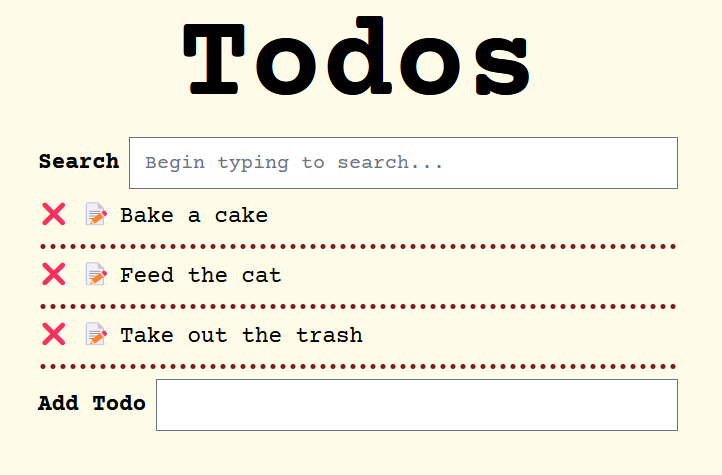
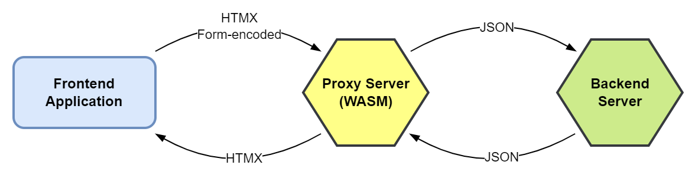

# Todo List Application
Demonstration of a todo list application using:
- [HTMX](https://htmx.org/) : high power tools for HTML
- [WASM](https://webassembly.org/) : WebAssembly as an HTMX Server Proxy
- [templ](https://templ.guide/) : a simple templating language alternative for Go
- [Tailwind CSS](https://tailwindcss.com/) : a utility-first CSS framework



## Originals:
This is a rewrite of some todo list applications that previously demonstrated HTMX:
- Clojure version: https://github.com/ndchorley/todo
- Go version: https://github.com/quii/todo
- Original (WASM-less) version: https://github.com/stackus/todos

My primary goal in this recreation of my other Todos repository was to learn how well a WASM Server Proxy might work in Go. Right now I see several reasons why you might want to use a WASM Server Proxy for HTMX frontends:

- *You miss loading large JavaScript libraries on the client and wish you could with HTMX again*

More seriously:
- You have a legacy server application that serves JSON, and you want to test out a new HTMX-based UI without having to change the server code
- You want to use a different language than your server to serve the HTMX frontend
- You want to minimize the size of the requests and responses between the client and server

## Run Requirements
- [Go](https://golang.org/) 1.19 or later

## Build Requirements
- Run requirements plus
- [Node.js](https://nodejs.org/) 18 or later

## Installation
- Clone this repository
- Install Task: https://taskfile.dev/installation/
- Run `task install` to install a few dependencies

## Running
- Run `task run` to start the server
- Visit http://localhost:3000

## Building
- Run `task build` to build the templates, the TailwindCSS styles, and the WASM file

## WebAssembly (WASM)
To build the proxy server I am used Nicolas Lepage's [go-wasm-http-server](https://github.com/nlepage/go-wasm-http-server) library. With it, I was able to move the original handler code into a "client" server with no changes.

Since this Todo application is still a basic application, I was able to reuse the majority of the original code between the client and server.

### Communication between the client and server
Between the UI and proxy server the communication is exactly the same as my original Todo application Between the proxy server and the server I am able to utilize any protocol I want, JSON for example.



The proxy server could be doing a number of things you might find a Backend-For-Frontend (BFF) server might do. You could use it to:
- Transform the data from the server to a format that is easier for the client to consume (what I'm doing in this application)
- Aggregate data from multiple servers
- Cache data
- ...more

### WASM size
The WASM file is currently sitting at ~8.9mb. I have not made much effort in reducing it, and I am sure it could be trimmed down. I did give TinyGo a try, and it spat out a ~2.7mb file, which is within the realm of reasonable, but the application did not work. I didn't research the issue very deeply, but I suspect it might be the `.String()` calls that are used to convert the UUIDs to strings. I could switch all the IDs to be integers instead of UUIDs, but I and many others use UUIDs for IDs in their real-world applications so that seems like a non-starter.

I do not have any benchmarks to say if using a WASM Server Proxy is faster or slower than a traditional server. The server now serves much smaller JSON responses that will not grow in size if I were to complicate the HTMX, or lay on dozens more TailwindCSS classes.

## HTMX
Like the two original versions, this application uses HTMX to update the UI. In this recreation, the functionality remains mostly the same with only a few minor changes. The use of templ and TailwindCSS are the main differences.

### _hyperscript and Sortable.JS
Some additional JavaScript libraries are included to help with the interactivity. I am simply including libraries that the previous Todo applications used as well to keep the functionality the same.

- https://hyperscript.org/
- https://sortablejs.github.io/Sortable/

## Templ
The original Go version used [html/template](https://pkg.go.dev/html/template) to render the HTML. This version uses [templ](https://templ.guide/) instead. The main difference is that templ uses a generation step to compile them into Go code. This means that the templates are type-safe and can be checked at compile time.

I wanted to learn more about templ, and as I stated above, this seemed like a good opportunity to try it out with some other technologies I was interested in. I wanted to see how templ would work with a low or no JavaScript frontend library like HTMX.

### Testing the templates
I didn't write any tests that tested the templates directly, which would be testing the generated code, but I did test the handlers that used the templates. I tested that the handler was returning the correct response for a normal HTML request and for the HTMX requests. To pass those tests, the handler had to return the correct content in addition to the correct status and headers. Testing the templ components was not very hard and was easy to do in the table-driven testing style.

## Tailwind CSS
Another difference is that all the styling is being handled with TailwindCSS. This is what Node and NPM are used for. 

## Organization and Layout
This application code could be more simple, but I wanted to also see how everything I was playing with might come together if I was building a larger application. For example, I could have skipped on some of the organization and directories. Also, the use of interfaces could be skipped in favor of just using the concrete types, but I wanted to make testing easier and don't find it too much of a burden to add and use them.

## Quirks
I ran into a few oddities and technology compatibility issues that I had to work around.

### Broken lists
I kept having a strange issue with the rendering of the todos list. Whenever I refreshed the page only the first todo would be a child of the `ul` element like it should be. The second todo and on would be outside of that element. I verified the content was being generated correctly and sent to the browser correctly, but viewing the source in the inspector in multiple browsers would always show the list getting broken up.

The server would generate and send the following HTML to the browser:
```html
<ul>
  <li>...</li>
  <li>...</li>
  <li>...</li>
</ul>
```

But the browser would render and show in the inspector:
```html
<ul>
  <li>...</li>
</ul>
<li>...</li>
<li>...</li>
```
I tried both Firefox and Edge, and it was always the same weirdness. So I changed that bit of the templates to use some nested divs. This also meant changing some of the HTMX as well, but it was a small change. This avoids the issue and the list is rendered correctly now. I say "avoids the issue" because I still don't know why it was happening.

### Templ and _hyperscript
Another small issue I ran into had to do with the preferred attribute name for the _hyperscript code. It suggests you use `_` as the attribute name but templ does not parse this character as a valid attribute beginning. All was not lost because _hyperscript also allows you to use `data-script` as the attribute name which has no problem being parsed by templ. This is what I ended up doing, and it works fine.
